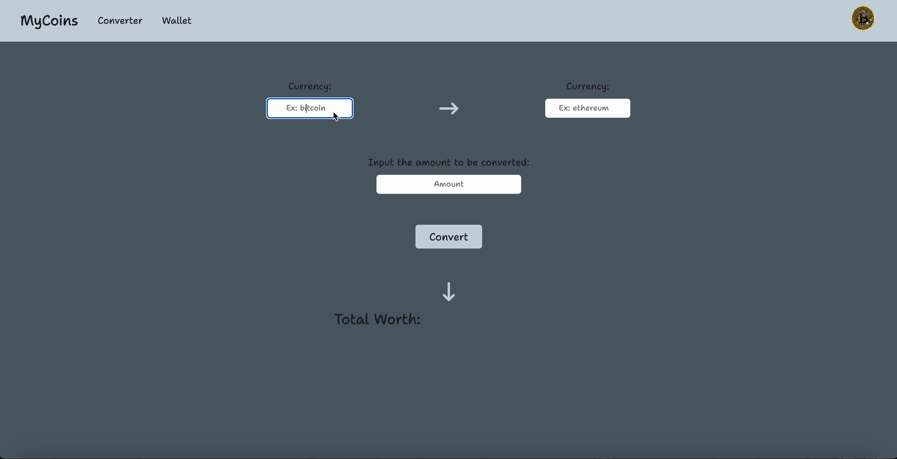

# Crypto Wallet

A web application that provides a comprehensive platform for cryptocurrency enthusiasts to stay up-to-date with the top 50 cryptocurrencies, seamlessly convert between different currencies, and manage their personal crypto wallet.

## Why I Built This

Driven by my passion for cryptocurrency and its transformative technology, I developed this wallet. Its purpose is to enable regular price monitoring of various cryptocurrencies and to keep track of your crypto portfolio.

## Technologies Used

- HTML5
- CSS3
- JavaScript
- GitHub
- Figma
- API: [CoinCap](https://docs.coincap.io/#0a8102a5-c338-4661-aa99-f1c57661b5b1)

## Live Demo

Try the application live at [https://justinsong1608.github.io/crypto-wallet/](https://justinsong1608.github.io/crypto-wallet/)

## Features

- User can check information, including price, market cap, and more, for the top 50 cryptocurrency.
- User can calculate the value of buying or selling a specified amount of cryptocurrency in US dollars or antoher cryptocurrency.
- User can add a cryptocurrency to their wallet, expanding their portfolio of supported assets.
- User can track their crypto holdings by adding the amount of each cryptocurrency they possess.
- User can update their crypto holdings amount.
- User can view their total holdings.
- User can remove a cryptocurrency from their wallet.
- Table updates every 30 seconds with the latest cryptocurrency information.

## Preview

## Stretch Features I'd like to Implement

- User can view the percent change of each cryptocurrency, displayed as either green or red based on whether the percent is positive or negative.
